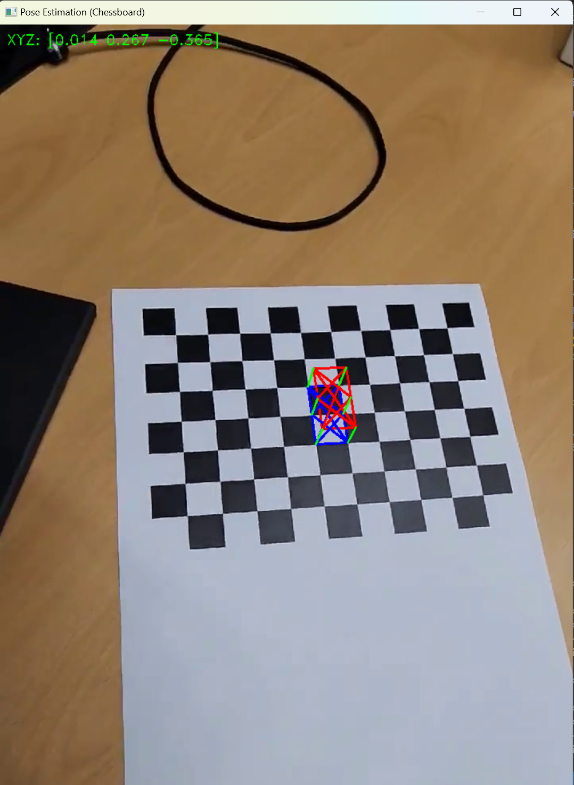

# Camera Pose Estimation and AR

This Python script performs the task of estimating the pose of a camera and drawing magical box using a chessboard pattern.

## example
    
## Usage

1. Prepare a video file with a chessboard pattern. This script will find the chessboard pattern and estimate the camera's pose from it.

2. Run the script. The script will find the chessboard pattern in the video and use it to estimate the camera's pose.

3. Draw a 3D box and 'X' shape on the 2D image using the estimated pose.

## Code Explanation

This script uses OpenCV to estimate the camera's pose and draw the result on an image.

- Camera Pose Estimation: It finds the corners of the chessboard and uses them to estimate the camera's pose. This is done using `cv.findChessboardCorners()` and `cv.solvePnP()` functions.

- Drawing the Box: It uses the estimated pose to draw a 3D box on the 2D image. This is done by converting the 3D coordinates to 2D image coordinates using `cv.projectPoints()` function and then connecting the converted coordinates to draw the box using `cv.polylines()` and `cv.line()` functions.

- Drawing the 'X': It draws an 'X' shape on the image. This is done in the same way as drawing the box.

- Printing the Camera Location: It calculates the camera's location and prints it on the image. This is done by converting the rotation vector to a rotation matrix using `cv.Rodrigues()` function and then calculating the camera's location using this matrix. Then, it prints the calculated location on the image using `cv.putText()` function.

- Displaying the Image and Handling Key Events: It displays the drawn image on the screen and handles key events. This is done using `cv.imshow()` and `cv.waitKey()` functions.

## Required Libraries

- OpenCV
- NumPy

**Note:** This script uses a chessboard pattern to estimate the camera's pose. Therefore, it cannot be used with videos that do not have a chessboard pattern.